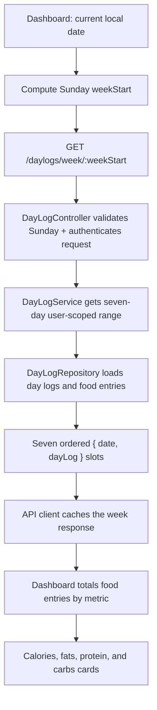

# Implementation Plan: Live dashboard nutrition charts

## Goal

Replace the dashboard's hard-coded calorie, fat, protein, and carbohydrate chart values with the authenticated user's actual food-entry totals for the current Sunday-through-Saturday calendar week. The dashboard must show all seven days, treat dates without a day log as zero intake, and refresh after a food entry is saved.

## Current state

- The dashboard route is `/` and renders four `TodayAndWeek*` cards, each with local fixture data in `apps/web-frontend/src/verticals/dashboard/components/`.
- `GET /api/v1/daylogs/:date` returns a single `DayLogResponse | null`; the log page depends on that shape, so changing it would be a breaking API and UI change.
- `DayLog` owns its food entries. The PostgreSQL repository can load one aggregate by date but cannot yet load a user's range of logs.
- A food entry contains every needed metric: `calories`, `totalFatGrams`, `proteinGrams`, and `totalCarbohydrateGrams`.
- The only implemented nutrition targets are the static `DAILY_TARGETS` used by the log page. There is not yet a persisted per-user goal API.

## Proposed design

Add a separate authenticated read endpoint rather than changing the existing per-day endpoint:

```text
GET /api/v1/daylogs/week/:weekStart
```

`weekStart` is an ISO calendar date supplied by the client and must be a Sunday. The response represents the inclusive Sunday-to-Saturday range and contains exactly seven ordered slots:

```ts
{
  weekStart: "2026-08-02",
  weekEnd: "2026-08-08",
  days: [
    { date: "2026-08-02", dayLog: DayLogResponse | null },
    // six further consecutive dates
  ],
}
```

The explicit date slots make missing logs unambiguous, keep weekday labels stable, and let the dashboard render zero for days without food entries. The server uses the authenticated user ID only; the client never supplies a user ID.



### Boundary decisions

| Decision | Rationale | Consequence |
| --- | --- | --- |
| Keep `GET /daylogs/:date` unchanged | The log page already consumes a nullable single-log response. | No regression or migration for existing clients. |
| Use a Sunday `weekStart` route parameter | A date-only client input avoids server-time-zone ambiguity and yields a stable React Query key. | Reject a valid ISO date that is not Sunday with `400`. |
| Return seven `{ date, dayLog }` slots | Missing data remains distinguishable from an omitted response item. | The dashboard can render current/future empty days as zero without client-side gap filling. |
| Load the full aggregates for the initial dashboard | The existing public day-log representation already has the food-entry fields needed to calculate all four metrics. | No new reporting schema or migration; the repository must avoid a query per day-log. |
| Retain `DAILY_TARGETS` for chart limits | User-specific goals are not stored or exposed yet. | Intake is live; personalized targets are explicitly out of scope for this change. |

## API contract

### Request

`GET /api/v1/daylogs/week/:weekStart`

- `weekStart`: required `YYYY-MM-DD` ISO calendar date and Sunday.
- Authentication: existing access-session middleware.
- The request has no user ID, range length, or timezone parameter.

### Success response

- Status: `200`.
- `weekStart` and `weekEnd` delimit one inclusive seven-day range.
- `days` has exactly seven consecutive Sunday-to-Saturday dates in ascending order.
- Every slot belongs to the authenticated user or contains `dayLog: null`.

### Errors

- Invalid ISO date or non-Sunday `weekStart`: `400` with the existing validation-error shape.
- Unauthenticated request: the existing middleware returns `401` before controller execution.
- Repository/service failures: existing controller error handling applies; do not expose storage details.

## Implementation tasks

## Task 1: Define the weekly read contract and application query

**Description:** Add the typed, validated week request and response contract, then extend the Day Log application boundary with a user-scoped range query. The service returns the persisted `DayLog` aggregates for a validated inclusive date range; it does not create missing logs.

**Acceptance criteria:**

- [ ] `@calibrate/api-contracts` exports request/response schemas and types for the week endpoint, including a nullable per-date day log and an exact seven-item response.
- [ ] The week-start validator accepts only Sunday ISO dates and rejects malformed dates and other weekdays.
- [ ] `IDayLogRepository` and `IDayLogService` expose a clear read operation for a user's date range/week without affecting the existing single-day operation.
- [ ] The application result contains no data from another user and never creates empty logs.

**Test plan:**

- [ ] Contract unit tests parse a valid seven-day response and reject non-Sunday dates, invalid ISO strings, incorrect order, duplicate dates, and a response that does not contain seven slots.
- [ ] Service unit tests verify delegation of the authenticated user ID and seven-day bounds, empty result propagation, and repository-error propagation.
- [ ] Update test doubles so all implementations of the day-log port satisfy the expanded interface.

**Verification:**

- [ ] `npx nx run @calibrate/api-contracts:test`
- [ ] `npx nx run backend:test`

**Dependencies:** None.

**Files likely touched:**

- `packages/api-contracts/src/day-log-requests.ts`
- `packages/api-contracts/src/day-log-responses.ts`
- `packages/api-contracts/src/log-page-contracts.test.ts`
- `apps/backend/src/application/ports/day-log-repository.ts`
- `apps/backend/src/application/services/day-log-service.ts`
- `apps/backend/src/application/services/__tests__/day-log-service.test.ts`

**Estimated scope:** Medium.

## Task 2: Implement the PostgreSQL week query and protected HTTP endpoint

**Description:** Implement the repository range read using a user-and-date-bounded day-log query plus a batched food-entry query. Reconstitute the returned day logs, fill the validated week's missing dates with `null` at the presentation boundary, and expose the protected route.

**Acceptance criteria:**

- [ ] The repository queries only rows whose `user_id` matches the authenticated user and whose dates are within the inclusive seven-day bounds.
- [ ] Food entries for the selected logs are loaded in a batch and correctly grouped into breakfast, lunch, dinner, and snacks before aggregate reconstitution.
- [ ] The controller produces seven ordered response slots, maps populated aggregates through the existing response mapper, and returns `null` for dates with no persisted log.
- [ ] `GET /daylogs/:date` remains unchanged and `GET /daylogs/week/:weekStart` runs through the existing authentication middleware.

**Test plan:**

- [ ] Repository unit tests cover inclusive first/last dates, no matching rows, interleaved entries across multiple logs, and exclusion of an overlapping row owned by another user.
- [ ] Controller unit tests cover valid mapping, `null` slot generation, rejected validation, and service invocation with `req.auth.userId` only.
- [ ] Route integration test verifies an unauthenticated request receives `401`, while a valid authenticated request reaches the controller and returns the schema-valid week response.

**Verification:**

- [ ] `npx nx run backend:test`
- [ ] `npx nx run backend:typecheck`

**Dependencies:** Task 1.

**Files likely touched:**

- `apps/backend/src/infrastructure/persistence/repositories/postgres-day-log-repository.ts`
- `apps/backend/src/infrastructure/persistence/repositories/__tests__/postgres-day-log-repository.test.ts`
- `apps/backend/src/presentation/controllers/day-log-controller.ts`
- `apps/backend/src/presentation/controllers/__tests__/day-log-controller.test.ts`
- `apps/backend/src/presentation/routes/day-log-routes.ts`
- `apps/backend/src/presentation/routes/__tests__/day-log-routes.integration.test.ts`
- `apps/backend/src/presentation/mappers/day-log-response-mapper.ts`

**Estimated scope:** Large; split the repository work from the controller/route work if either grows beyond this defined behavior.

## Checkpoint: API weekly read

- [ ] The contract, controller, and client-independent endpoint agree on one schema.
- [ ] A user can only retrieve their own seven-day logs.
- [ ] Existing single-day log tests still pass.

## Task 3: Add the API-client week query and refresh behavior

**Description:** Add a typed `getWeekDayLogs` function, query options, and hook to `@calibrate/api-client`. Use a week-specific React Query key that includes the Sunday `weekStart`; update food-entry saving to invalidate cached weekly views as well as the selected-day view.

**Acceptance criteria:**

- [ ] The client validates `weekStart`, requests `/daylogs/week/:weekStart`, and validates the response using the shared contract schema.
- [ ] Week cache keys cannot collide with `dayLogQueryKey(date)`.
- [ ] A successful food-entry save invalidates the affected day and dashboard week query so mounted dashboard cards refetch.
- [ ] The public package index exports the new operation.

**Test plan:**

- [ ] API-client tests assert the exact request path, request validation failure, response-schema use, and week key shape.
- [ ] Mutation tests assert both the individual-day and weekly cache invalidation behavior.

**Verification:**

- [ ] `npx nx run @calibrate/api-client:test`
- [ ] `npx nx run @calibrate/api-client:typecheck`

**Dependencies:** Task 1 and Task 2.

**Files likely touched:**

- `packages/api-client/src/day-logs/get-week-day-logs.ts`
- `packages/api-client/src/day-logs/get-week-day-logs.test.ts`
- `packages/api-client/src/day-logs/save-food-entry.ts`
- `packages/api-client/src/day-logs/save-food-entry.test.ts`
- `packages/api-client/src/index.ts`

**Estimated scope:** Medium.

## Task 4: Build one reusable dashboard nutrition model and connect live data

**Description:** Move the dashboard's nutrition calculation and daily targets to a domain-neutral frontend helper, then have `Dashboard` fetch the current calendar week once. Convert its seven response slots into four card models (calories, fats, protein, carbs), each with today's total, seven weekday totals, and the existing daily limit. Refactor the calorie and macro cards to render that data rather than local fixtures.

**Acceptance criteria:**

- [ ] The dashboard computes the current local Sunday and uses it as the sole data-fetch boundary for all four cards.
- [ ] Each card totals all food entries across every meal using its correct metric field: `calories`, `totalFatGrams`, `proteinGrams`, or `totalCarbohydrateGrams`.
- [ ] The donut uses today's slot and every weekly chart always contains seven Sunday-to-Saturday values; absent logs and empty meals render as zero.
- [ ] Calories, fats, protein, and carbs use the existing targets (`1800`, `60g`, `120g`, `220g`) consistently rather than the dashboard fixture limits.
- [ ] Pending and error states preserve the dashboard layout, announce loading appropriately, and avoid rendering misleading fixture numbers. Existing chart text alternatives and data tables describe the live values.
- [ ] The existing Fats analytics link, responsive desktop/mobile layouts, and chart component APIs remain functional.

**Test plan:**

- [ ] Pure dashboard-model tests cover a fully populated week, missing days, entries spread across meals, zero totals, today being absent, and each of the four metric mappings.
- [ ] Component tests verify live values reach donut charts, weekly bar charts, and accessible summary tables without hard-coded fixture text.
- [ ] Dashboard integration test mocks the week response and verifies loading, success, error toast, and a refetch after a food-entry mutation invalidation.

**Verification:**

- [ ] `npx nx run web-frontend:test`
- [ ] `npx nx run web-frontend:typecheck`
- [ ] Manual: add a food entry dated today, navigate to the dashboard, and confirm its four cards and text alternatives update after the query refreshes.

**Dependencies:** Task 3.

**Files likely touched:**

- `apps/web-frontend/src/shared/nutrition/nutrition-totals.ts` (new)
- `apps/web-frontend/src/pages/logs/log-page-helpers.ts`
- `apps/web-frontend/src/pages/dashboard/Dashboard.tsx`
- `apps/web-frontend/src/verticals/dashboard/dashboard-nutrition-model.ts` (new)
- `apps/web-frontend/src/verticals/dashboard/components/TodayAndWeekCalories.tsx`
- `apps/web-frontend/src/verticals/dashboard/components/TodayAndWeekStat.tsx`
- `apps/web-frontend/src/verticals/dashboard/components/TodayAndWeekStatsAccessibility.test.tsx`
- `apps/web-frontend/src/verticals/dashboard/dashboard-nutrition-model.test.ts`
- `apps/web-frontend/src/pages/dashboard/Dashboard.integration.test.tsx`

**Estimated scope:** Large; keep the calculation/model extraction and card wiring as two commits if the component refactor becomes broad.

## Task 5: Run cross-boundary regression checks and document the completion evidence

**Description:** Verify the complete path from typed wire contract to dashboard rendering, including cache refresh after a new food entry. Record the actual commands and manual outcome in the implementation PR rather than changing unrelated dashboard cards.

**Acceptance criteria:**

- [ ] The single-day Logs page still renders a day log and its progress calculations correctly.
- [ ] The live dashboard cards remain usable with an entirely empty week, a partially populated current week, and a fully populated historical week response.
- [ ] No migration, goal schema, or unrelated dashboard insight card is introduced.

**Test plan:**

- [ ] Run affected unit suites from all three ownership boundaries: contracts, backend, and web frontend.
- [ ] Add a focused browser/integration regression only if the existing web test setup can exercise the API-client cache invalidation through the dashboard route.

**Verification:**

- [ ] `npx nx run @calibrate/api-contracts:test`
- [ ] `npx nx run backend:test`
- [ ] `npx nx run @calibrate/api-client:test`
- [ ] `npx nx run web-frontend:test`
- [ ] `npx nx run backend:typecheck`
- [ ] `npx nx run @calibrate/api-client:typecheck`
- [ ] `npx nx run web-frontend:typecheck`

**Dependencies:** Task 4.

**Files likely touched:** Test files from Tasks 1–4 only.

**Estimated scope:** Small.

## Risks and mitigations

| Risk | Impact | Mitigation |
| --- | --- | --- |
| Server and browser derive different weeks around a timezone boundary | A chart may show the wrong week. | The browser calculates a local Sunday and sends that date; the server treats it as a calendar boundary, not a timestamp. |
| Missing logs make weekly bars appear incomplete | Users cannot compare a full week. | The endpoint returns seven ordered date slots and the model turns `null` into zero totals. |
| Week query becomes an N+1 read | Dashboard latency rises with the number of days. | Fetch day logs in one bounded range query and their food entries in one batched query. |
| Food saves leave a mounted dashboard stale | Charts fail the “live data” expectation. | Invalidate the cache namespace for week queries in the existing food-save mutation. |
| Per-card fixtures drift from log-page targets | The same intake appears to have different limits. | Share the existing daily-target values through a domain-neutral helper. |
| Personalized targets are expected | The chart limits remain generic. | Treat persisted/user-specific goals as a separate follow-up; no such source exists in the current API. |

## Out of scope

- Persisting, editing, or serving personalized calorie or macro goals.
- Making `ConsistencyScore`, `HighImpactSwap`, or `YesterdayRecap` live.
- Historical week navigation or analytics beyond the dashboard's current calendar week.
- Database migrations or changing the `DayLog` aggregate's write behavior.

## Completion checklist

- [ ] API contract reviewed and agreed.
- [ ] Week endpoint returns exactly seven authenticated-user slots.
- [ ] All four dashboard charts display real food-entry totals.
- [ ] Missing logs render as zero and no fixture data remains in the cards.
- [ ] Food-entry saves cause affected dashboard data to refetch.
- [ ] Focused tests and typechecks pass.
- [ ] Plan reviewed and approved before implementation.
